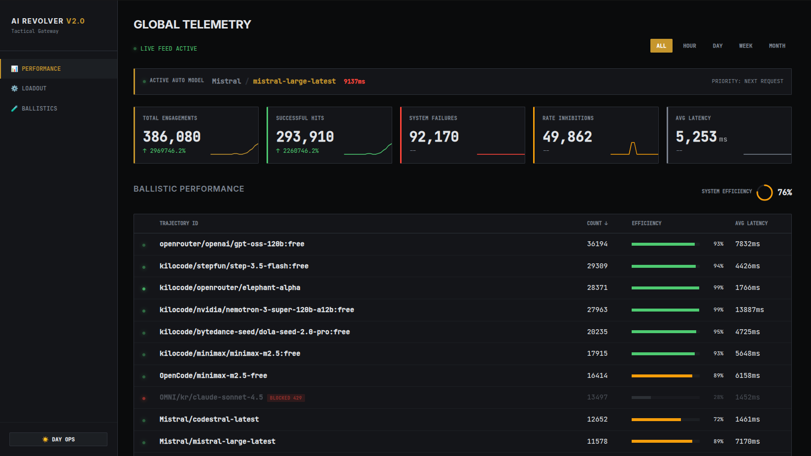
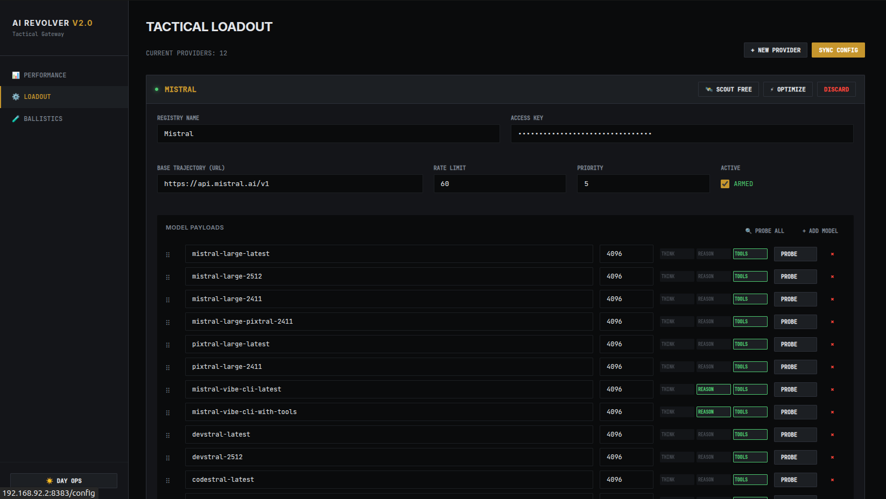
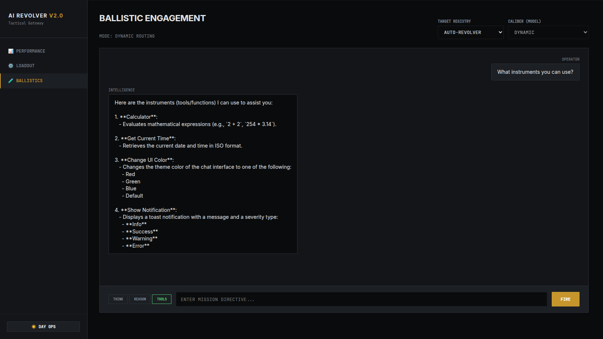

<div align="center">

# 🔫 AI Revolver

**A smart proxy service designed specifically for free LLM providers.**

[](https://opensource.org/licenses/MIT)
[](https://golang.org/)
[](https://github.com/naranor/ai-revolver/actions)
[](https://www.docker.com/)

*While it was created specifically for the OpenClaw agent, it can be seamlessly used with any other AI agents.*

<br>


</div>

---

## ✨ The Killer Feature: Transparent Rate-Limit Failover

When a provider hits its rate limit, the proxy instantly and invisibly switches your agent to the next available provider. By pooling together multiple providers with free models, **AI Revolver creates the effect of a single, unlimited LLM for your workflows.**

## 🚀 Features

- ⚡ **Resilient Failover:** Automatic retry on backup providers when an attempt times out or fails (per-candidate timeout defaults to **300s**, up to **5** attempts).
- 🤖 **Multiple Providers:** Support for OpenRouter, Groq, OpenAI, Ollama, and more.
- 🧠 **Auto Mode:** Automatic model selection based on priority and availability.
- 🛡️ **Context-Aware:** Upstream requests are cancelled immediately when a client disconnects.
- 🔌 **Streamable HTTP (MCP):** Full support for MCP clients via the `/mcp` endpoint.
- 📊 **Built-in Analytics:** Statistics storage in SQLite with a sleek Web UI for monitoring.
- 🚀 **High Performance:** Async logging (zerolog) and DB writes with a worker pool.

## 📸 Web UI

Built-in React dashboard for monitoring, configuration, and live testing.

### Performance

Real-time telemetry: request counts, success rate, latency, and per-model health.



### Loadout

Manage providers, API keys, model payloads, priorities, and rate limits.



### Ballistics

Interactive chat playground with tool-use support and model probing.



## 🛠️ Tech Stack

| Category | Technology | Description |
| :--- | :--- | :--- |
| **Backend** | Go 1.24+ | Core proxy logic and API |
| **Frontend** | React 18 | Web UI for configuration and monitoring |
| **Database** | SQLite | Fast, local storage for statistics |
| **Deployment**| Docker | Multi-stage build with Nginx and Supervisor |

## 🚦 Quick Start

### Option 1: Docker (Recommended)
The fastest way to get started.

```bash
# Clone the repository
git clone https://github.com/naranor/ai-revolver.git
cd ai-revolver

# Start the service
docker-compose up -d
```
The Web UI will be available at `http://localhost:8080`, and the API at `http://localhost:8080/api/v1`.

### Option 2: Manual Build
Prerequisites: Go 1.24+, Node.js 18+

```bash
# Build the project
./build.sh --no-test

# Run the proxy
cd build
./ai-revolver -port 8081 -latency-threshold 10000
```

## ⚙️ Configuration & Usage

The configuration is stored in `data/config.json`. You can edit it manually or via the Web UI.

<details>
<summary><strong>📝 Example Configuration (config.json)</strong></summary>

```json
{
  "providers": [
    {
      "name": "openai",
      "api_key": "your-api-key",
      "base_url": "https://api.openai.com/v1",
      "enabled": true,
      "models": [
        {
          "name": "gpt-4o-mini",
          "max_tokens": 256000,
          "thinking": false,
          "reasoning": true,
          "tools": true
        }
      ],
      "rate_limit": 30,
      "priority": 1
    }
  ],
  "auto_mode": {
    "enabled": true,
    "fallback_strategy": "round-robin"
  },
  "max_retries": 5,
  "connect_timeout_seconds": 5,
  "response_timeout_seconds": 300,
  "warmup_enabled": true,
  "warmup_interval": 180,
  "warmup_debounce": 60
}
```
</details>

<details>
<summary><strong>🔀 Model Selection Algorithm</strong></summary>

1. **Tiered selection** — candidates are ordered: **Active** → **Degraded** (high EWMA latency) → **BlockedTemp** (sorted by latency within each tier).
2. **Round-robin within tiers** — model[0] from all providers, then model[1], etc.
3. **Last successful model priority** — within the Active tier, the last successful model is tried first.
4. **Health checks** — model status is updated per provider:model pair:
   - EWMA latency > threshold (default **10000 ms**) → **Degraded** (lower priority, not blocked).
   - 5xx / network timeout → **BlockedTemp** after **1** failure (exponential backoff).
   - 429 / 400 / other errors → **BlockedTemp** for **5 minutes**.
   - 401 / 404 → **BlockedFatal** (permanently skipped).
5. **Rate limit check** — provider is skipped when `current_usage >= rate_limit`.
6. **Failover limit** — up to `max_retries` attempts per request (default **5**).
7. **Fallback** — if all models are blocked, selects the blocked model with the lowest EWMA latency.
</details>

<details>
<summary><strong>💻 CLI Options</strong></summary>

| Option | Default | Description |
|--------|---------|-------------|
| `-port` | 8081 | Port to listen on |
| `-latency-threshold` | 10000 | Latency threshold in ms to mark model as degraded (0 = disable) |
| `-block-duration` | 5 | Failure-tracker cleanup window in minutes (0 = disable cleanup) |
| `-max-idle-conns` | 100 | Maximum idle connections in pool |
| `-max-idle-conns-per-host` | 20 | Maximum idle connections per host (prevents blocking) |
| `-idle-conn-timeout` | 90s | Idle connection timeout |
| `-stream-buffer-size` | 2MB | Buffer size for streaming responses |
| `-config` | data/config.json | Path to config file |
| `-stats` | data/stats.db | Path to stats database |
| `-debug` | false | Enable debug logging |
| `-trace` | false | Enable trace logging for all payloads and responses |
</details>

## 🔌 API Endpoints

| Endpoint | Method | Description |
|----------|--------|-------------|
| `/api/v1/chat/completions` | POST | Proxy request to model |
| `/mcp` | POST | **Streamable HTTP (MCP)** endpoint |
| `/api/v1/test` | POST | Test model (probe) |
| `/api/v1/stats` | GET | Request statistics |
| `/api/v1/config` | GET/PUT | Configuration management |
| `/health` | GET | Health check |

<details>
<summary><strong>🤖 MCP Integration Example</strong></summary>

```bash
curl -X POST http://localhost:8081/mcp \
  -H "Content-Type: application/json" \
  -H "Accept: text/event-stream" \
  -d '{
    "jsonrpc": "2.0",
    "id": 1,
    "method": "tools/call",
    "params": {
      "name": "chat_completion",
      "arguments": {
        "model": "auto",
        "messages": [{"role": "user", "content": "Hello!"}],
        "stream": true
      }
    }
  }'
```
</details>

## 🤝 Contributing

Contributions are what make the open source community such an amazing place to learn, inspire, and create. Any contributions you make are **greatly appreciated**.

Please check out our [Contributing Guidelines](CONTRIBUTING.md) for more details.

## 📜 License

Distributed under the MIT License. See [`LICENSE`](LICENSE) for more information.
